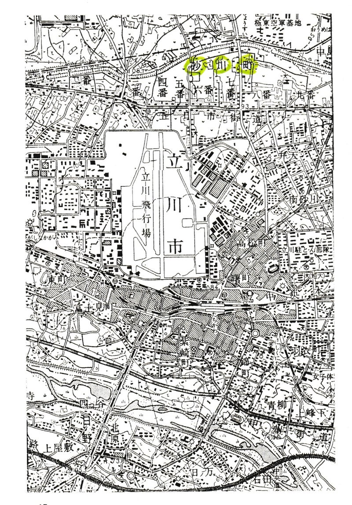

Original source / 原文の出典: https://ameblo.jp/2021fukuoka-ameba/entry-12732125839.html

ブログ開設と同時に、試行的に英文記事(1)をアップしました。

それについて内輪で相談した結果、抄訳でもいいから日本語版もアップした方がいいのでは、という意見・要望がありましたので、できるだけ反映させたいと思います。

対象読者が違うので、完全な対訳にはなりませんが、とりあえず以下、英文記事シリーズ第一弾（１）の日本語版です。

<h3 class="ameba_heading01" data-entrydesign-alignment="left" data-entrydesign-count-input="part" data-entrydesign-part="ameba_heading01" data-entrydesign-tag="h3" data-entrydesign-type="heading" data-entrydesign-ver="1.49.4" style="display:flex;flex-direction:column-reverse;margin:8px 0;color:#333;font-weight:bold">
  (1)　砂川について
</h3>

江戸の中心部から西、武蔵野平野に位置する砂川は、1736年にそう名づけられ、徳川幕府のもとで、地元の農民たちの新田開発によって、開拓や治水が進められた農村でした。

明治時代、1893年に、隣接する立川村とともに東京府に編入されて、砂川村となりました。

20世紀に入ると、立川も砂川も、大日本帝国の軍事目的のために土地が押収されていきました。1922年には飛行場ができて、周辺には関連施設が増え、経済は活性化しました。

しかしアジア・太平洋戦争中、何度もアメリカ軍の空襲を受け、1945年4月24日には100機以上のB29による爆撃で、地元の学校教師3人を含む、少なくとも134人が死亡したとされています。同年8月15日に戦争が終っても、軍用地となった砂川の土地はアメリカ軍に接収されて、農地として戻されることはありませんでした。

1950年の朝鮮戦争勃発により、米軍立川基地は極東最大の輸送基地となりました。サンフランシスコ講和条約によって日本が独立した後も、米国との単独講和で、同時に締結された日米安保条約によって、アメリカは在日米軍基地の運用を継続しました。

1940年に市に指定されていた立川は、1950年に人口6万人。米軍基地正門に直結していたため、米軍兵士の消費で経済が活性化しました。一方、滑走路の北端に位置する砂川は、様々な被害を受け、朝鮮戦争中には墜落事故も発生して、基地の脅威を思い知らされました。

そして突然1955年5月、米軍基地の滑走路延長計画が砂川町長に知らされました。砂川は前年に村から町となり、新町長が選挙で選ばれたばかりでした。拡張予定地の住民たちは、直ちに基地拡張に反対する同盟を結成しました。宮崎伝左衛門町長と町議会も、拡張計画に反対を表明しました。

にもかかわらず、東京都調達局は、早くも1955年の6月には土地測量を開始したのです。

（つづく）

