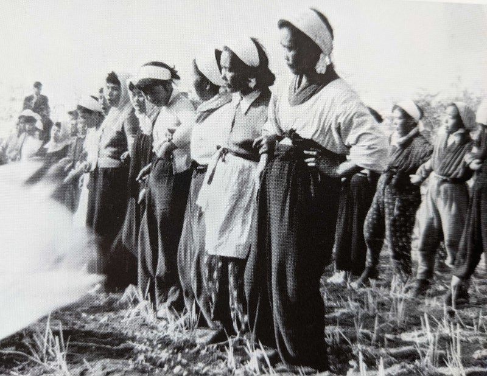
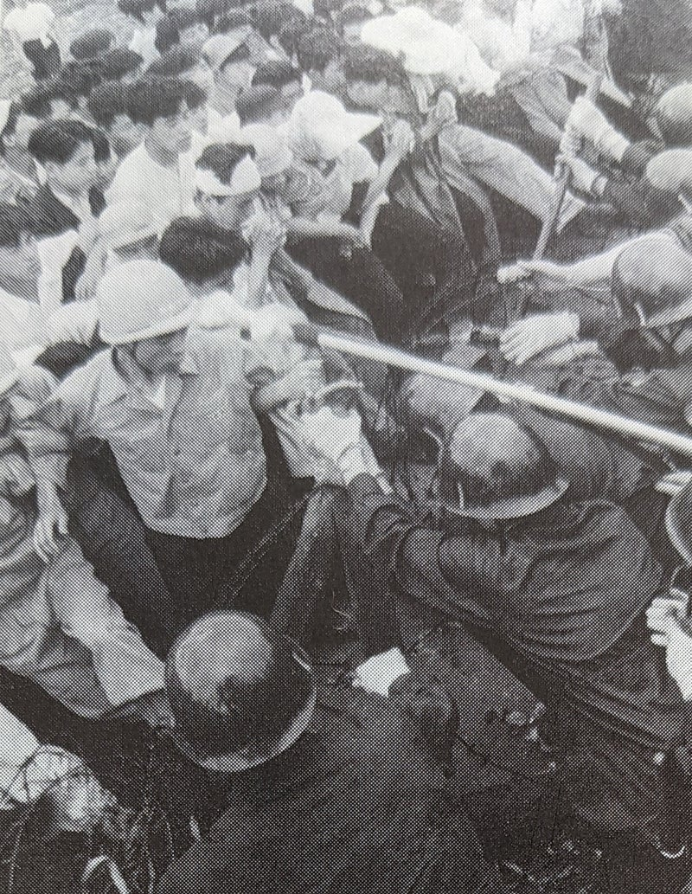
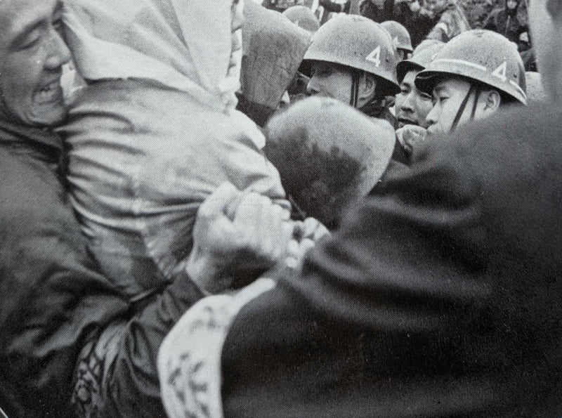

Original source / 原文の出典: https://ameblo.jp/2021fukuoka-ameba/entry-12732903462.html

 

<h3 class="ameba_heading01" data-entrydesign-alignment="left" data-entrydesign-count-input="part" data-entrydesign-part="ameba_heading01" data-entrydesign-tag="h3" data-entrydesign-type="heading" data-entrydesign-ver="1.49.4" style="display:flex;flex-direction:column-reverse;margin:8px 0;color:#333;font-weight:bold">
  （２）　砂川闘争について
</h3>

測量隊が来るたびに、農民たちは座り込みをしたり抗議をしたり、また下肥用の糞尿を使ったりして、非武装の抵抗を続けました。しかし、追い返してもいつまたやってくるかわからない、不安な生活を強いられました。

 

1955年9月13，14日の両日、1800人の警官に守られた測量隊が土地測量を強行しました。地元民・支援者たちはスクラムを組んで抵抗しましたが、、東京都調達局は、土地収用認定のために区域を示す杭を打つことに成功しました。この一件で、30人が逮捕され100人以上が負傷しました。

 

抵抗側にとっては衝撃的な敗北でしたが、基地拡張反対同盟・行動隊長の青木市五郎は、「土地に杭は打たれても、心に杭は打たれない」と、不屈の意志を表明しました。

 

非武装の抵抗者に対する警察の過剰な暴力について、多くのジャーナリスト・学者が懸念を表明しました。1955 年12月と翌年1月には、知識人らが砂川を訪れて、基地問題文化人懇談会を発足させました。

全学連も1956年9月に反対同盟支持を発表、何千もの支援学生が定期的に動員され、滞在して農作業を手伝ったり、子供たちの世話をする学生もいました。

 

 

 

亀井文夫監督のドキュメンタリー映画『流血の記録 砂川』に描かれたように、最大の激闘は、1956年10月12，13日に起きました。

続行中の測量は10月16日までの予定で、反対同盟は10月14日に、エスカレートする警察の暴力に対抗するため１万人動員を決定しました。

その晩、政府は測量中止を決定しました。

これは明らかに勝利であり、その後、社会党系の労働者も学生も、他の運動に忙しくなり、砂川を去っていきました。

 

しかしこれは、さらに長引く厳しい闘いの始まりに過ぎませんでした。事実、砂川闘争はその初期段階から多面的な運動であり、なかでも法廷闘争が極めて重要だったのです。

訴訟関係に最も多くの時間と労力を費やしたのは、副行動隊長の宮岡政雄でした。

彼は、若手弁護士と共に、あらゆる法的権利と手段に訴えて、闘うことになります。

 

（つづく）

 

