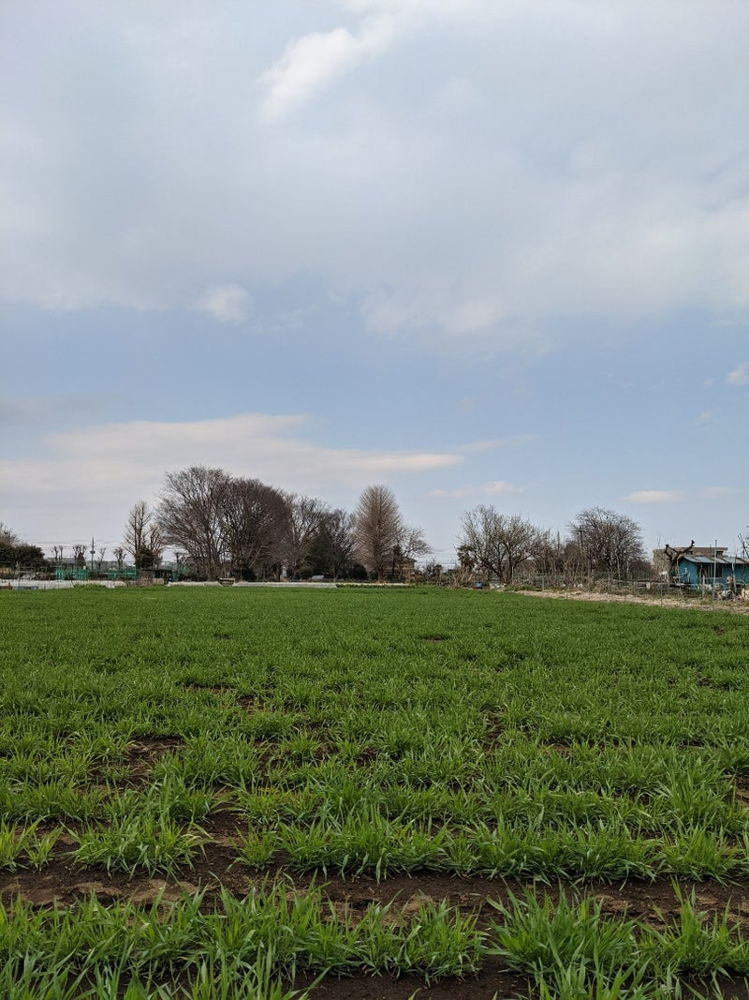
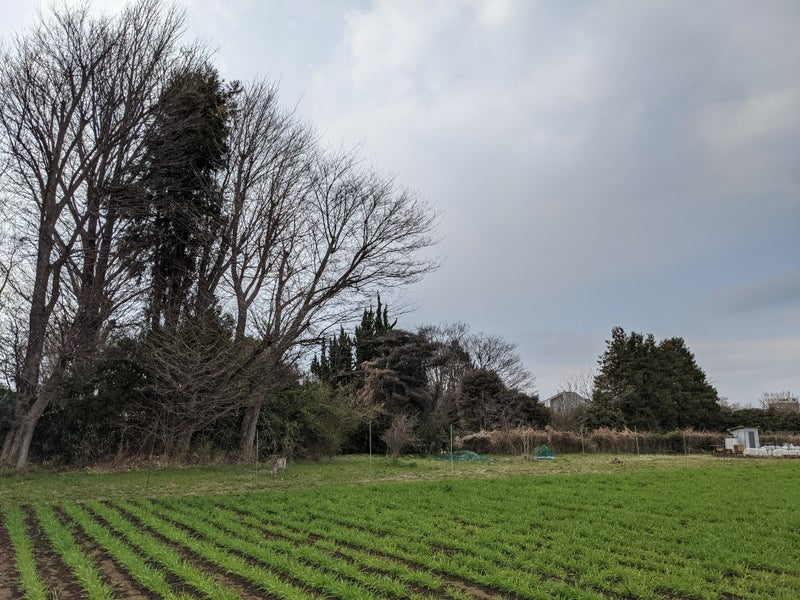
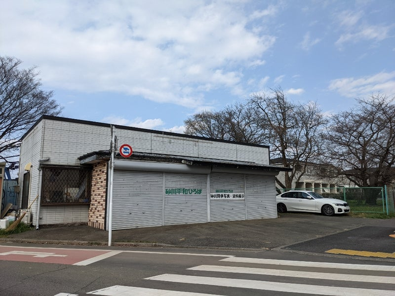
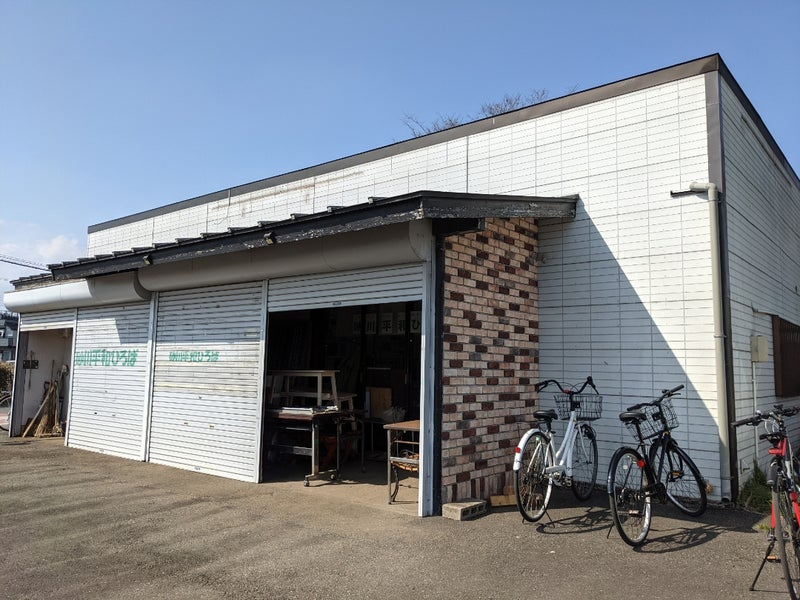
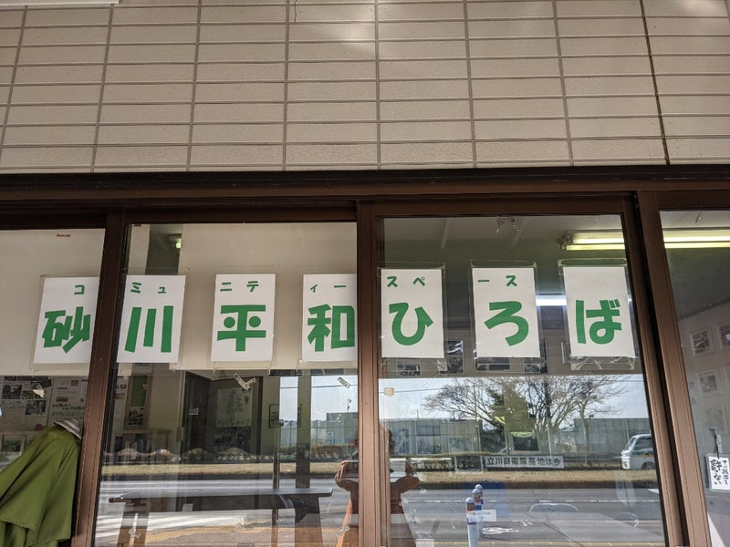
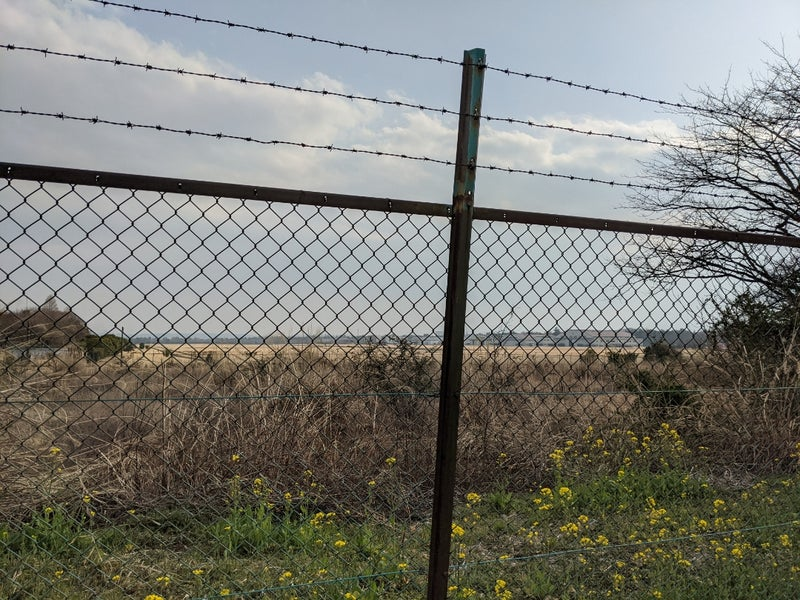

Original source / 原文の出典: https://ameblo.jp/2021fukuoka-ameba/entry-12735390003.html

麦畑 wheat fields

 

 

立川市「砂川平和ひろば」

Sunagawa Heiwa Hiroba, Tachikawa City

 

元・米軍立川基地　現・陸上自衛隊立川駐屯地

1977年に米軍立川基地が正式に変換される前に、自衛隊が強行移駐し

砂川平和ひろばから南北道路を隔てた向かい側にあるこのあたりは

現在 陸上自衛隊立川駐屯地となっています。

former US Air Base seen from the building of SHH across the street

Even before the US Air Base was officially returned to Japan in 1977, the Self-Defense Force forcedly and clandestinely moved in. 

Thus, this part of the land was turned into Camp Tachikawa of the Ground Self-Defense Force.

 

