Original source / 原文の出典: https://ameblo.jp/2021fukuoka-ameba/entry-12737973292.html

 

<h2 class="ameba_heading01" data-entrydesign-alignment="left" data-entrydesign-count-input="part" data-entrydesign-part="ameba_heading01" data-entrydesign-tag="h2" data-entrydesign-type="heading" data-entrydesign-ver="1.49.4" style="display:flex;flex-direction:column-reverse;margin:8px 0;color:#333;font-weight:bold">
  集会＆フィールドワークの記録　+　ポスター展
</h2>

＜2024年11月更新＞

 

2015年

・砂川闘争60周年集会「砂川の大地から、とどけ平和の声」

（映画『流血の記録 砂川』上映会と野外集会と被爆アオギリ植樹）

<a href="../../images/2022/ameblo-12737973292/01.jpg">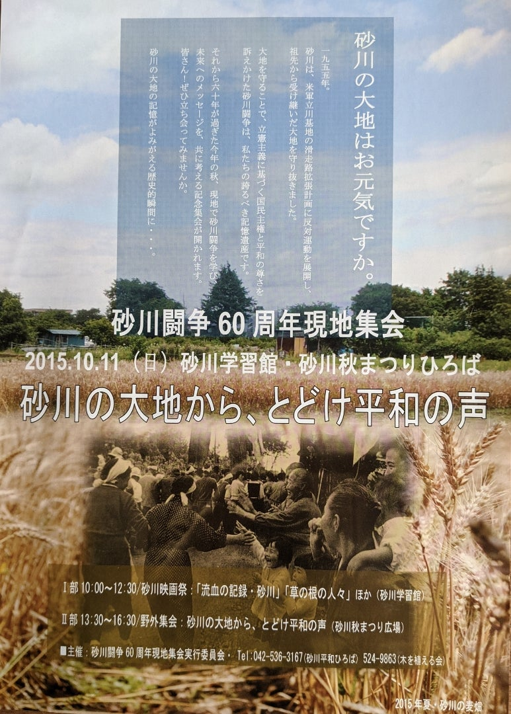</a>

 

<h3>2016年</h3>

・第2回集会

（映画『アオギリにたくして』上映会と中村里美さんトーク）

<a href="../../images/2022/ameblo-12737973292/02.jpg">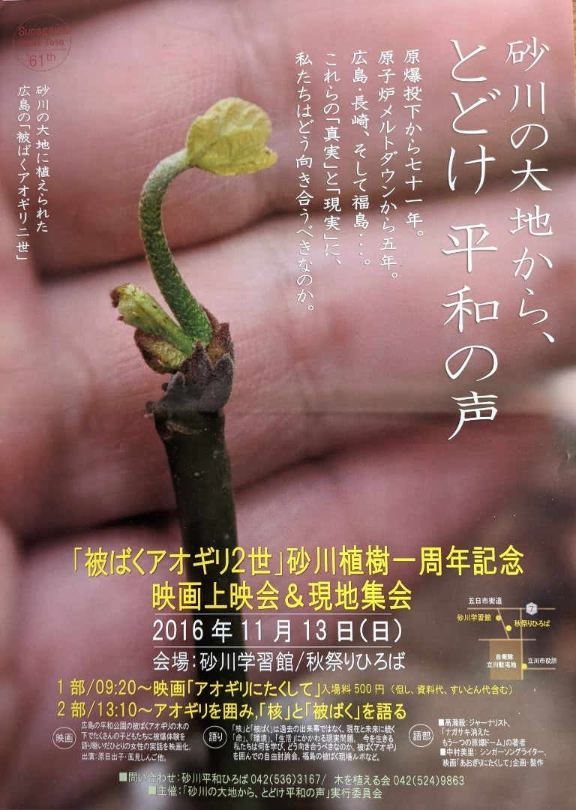</a>

 

<h3>2017年</h3>

・フィールドワーク企画「砂川闘争の現地を歩く」

・16ミリフィルム映画「武蔵野の大地を、今に思う」上映会

・第3回集会

（「米軍基地の『返還』を問う」上映会と座談会）

<a href="../../images/2022/ameblo-12737973292/03.jpg">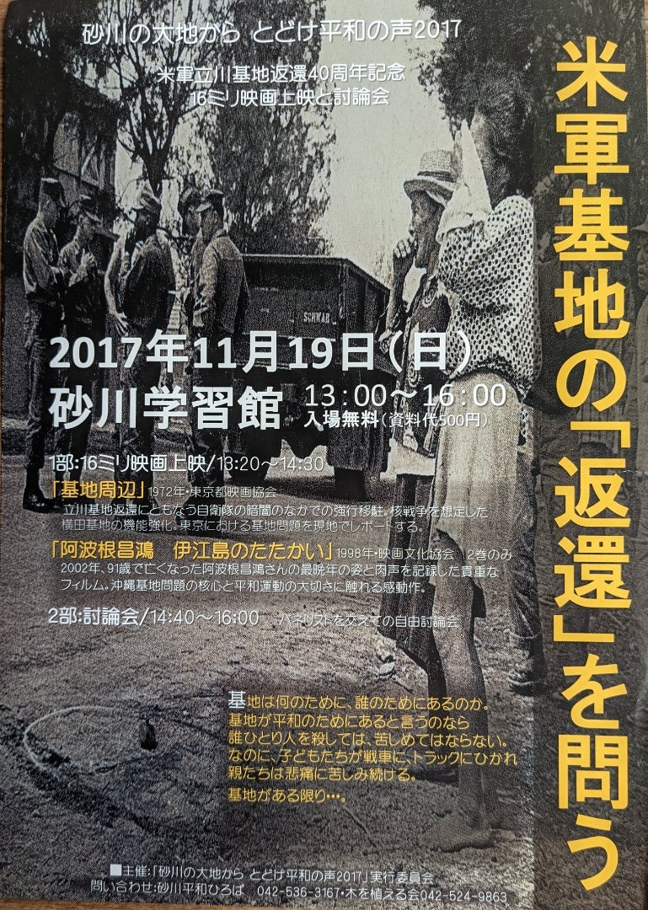</a>

 

<h3>2018年</h3>

・フィールドワーク企画「国営昭和記念公園を歩く」

（陸軍基地・米軍基地時代の痕跡を辿る）

・第4回集会

(「元拡張予定地」の現在と未来を考える座談会)

<a href="../../images/2022/ameblo-12737973292/04.jpg">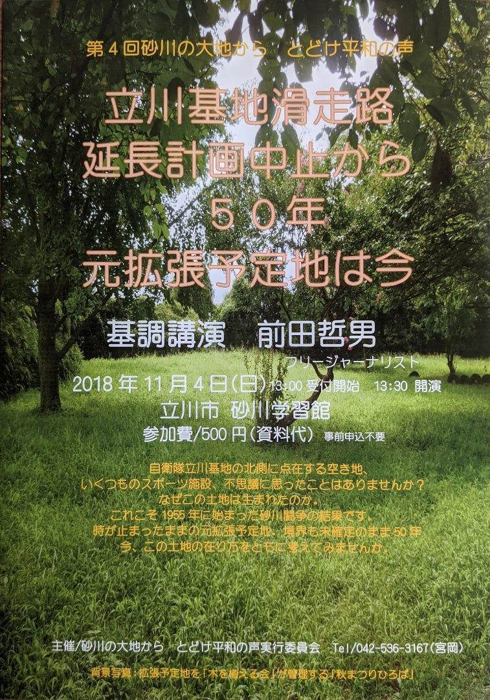</a>

 

<h3>2019年</h3>

・フィールドワーク企画「砂川事件の現場で語られる真実」

（土屋源太郎さんをお招きし現地を歩く）

・第5回集会

(「伊達判決60周年」の上映会と座談会)

<a href="../../images/2022/ameblo-12737973292/05.jpg">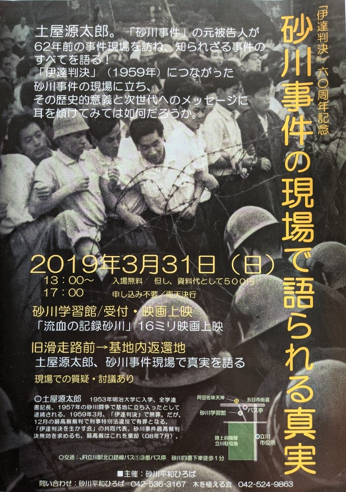</a>

 

<h3>2020年</h3>

・第6回集会

(「砂川闘争65周年」鵜飼哲さんをお招きし青空講演会と座談会)

<h3><a href="../../images/2022/ameblo-12737973292/06.jpg" style="background-color: rgb(255, 255, 255); font-size: 22.4px;">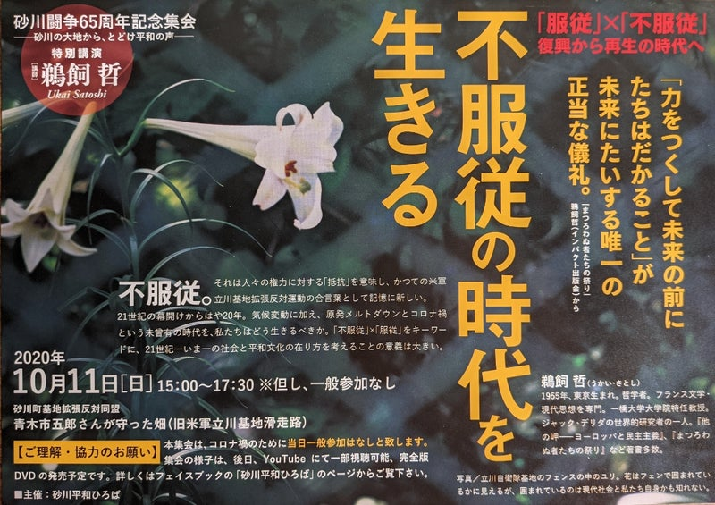</a></h3>

 

<h3>2021年</h3>

・第７回集会

（「基地問題と東アジアの平和」沖縄から

緒方修さんと木村朗さんをお招きし講演会）

 

<a href="../../images/2022/ameblo-12737973292/07.jpg">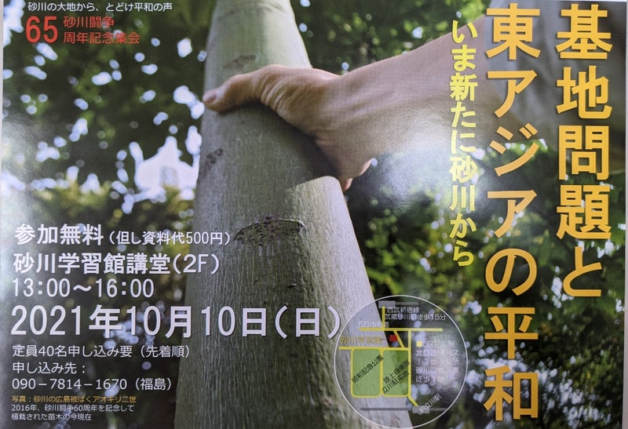</a>

<a href="https://isfweb.org/post-13749/" rel="noopener noreferrer" target="_blank">2021年「砂川平和ひろば」秋集会に関する趣意書：砂川の大地から、とどけ平和の声―基地問題と東アジアの平和― | ISF独立言論フォーラム (isfweb.org)</a>

 

<h3>2022年</h3>

・第８回集会

沖縄から田仲康博さん（元国際基督教大学教授）と

秋山道宏さん（沖縄国際大学准教授）

それに地元立川から大洞俊之さん（立川自衛隊監視テント村代表）

をお招きして　成城大学グローカル研究センターと共催。

砂川学習館立て替え前の最後の集会となった。

 

<a href="../../images/2022/ameblo-12737973292/08.jpg">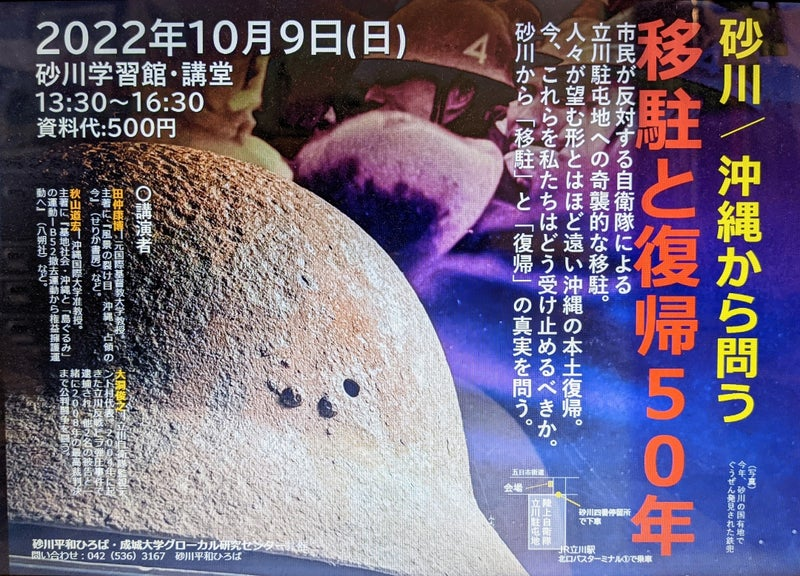</a>

 

2023年

・第９回集会

京都大学准教授の原田浩二さんに、メインスピーカーとしてオンライン参加していただき

「PFAS 汚染について学びなおす」と題して、　P FAS 問題の歴史、多摩および他地域での調査の概要などをお話いただいた。

またノンフィクション作家の高瀬毅さんからは、国分寺の血液検査に参加された経験、多摩の市民グループの動向などを報告していただき、立川市の環境問題の歴史と現状についても、「立憲ネット緑たちかわ意見交換会」の市議の皆さんからお話いただいた。

さらに、会場の関連パネル展示を担当した砂川平和ひろばの吉沢孝一さんからは、配布資料の説明があった。 
前回同様、成城大学グローカル研究センターとの共催。

会場は、砂川学習館が建て替え工事中のため、立川市こぶし会館 第１集会室に変わったが、例年以上に多様な参加者を迎え、質疑応答も活発に行われた。

 

<a href="../../images/2022/ameblo-12737973292/09.jpg">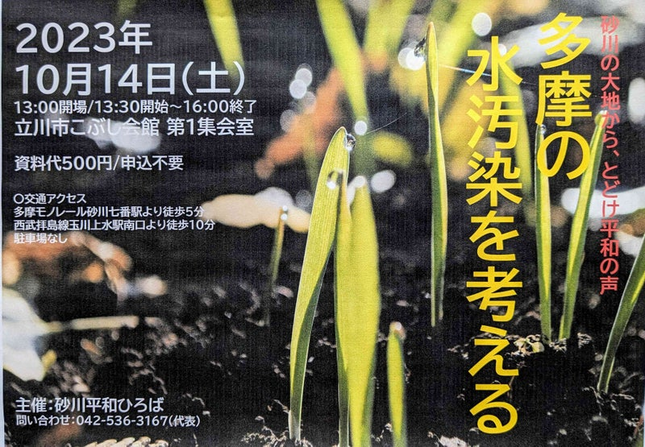</a>

 

2024年

・第10回集会

明治大学教員の丸川哲史さんを講師にお迎えし、「砂川と台湾―東アジア（新）冷戦危機をどう認識するのかー」と題する講演を中心に行われた。

砂川平和ひろばのメンバーからも、砂川と台湾との縁を象徴する宮岡政雄・基地拡張反対同盟副行動隊長の台湾日記や、東アジアの平和を考え続けてきた砂川平和しみんゼミの活動について、説明があった。

砂川学習館が建て替え工事中のため、たましんRISURUホールの地階サブホールでの開催となった。

 

<a href="../../images/2022/ameblo-12737973292/10.jpg">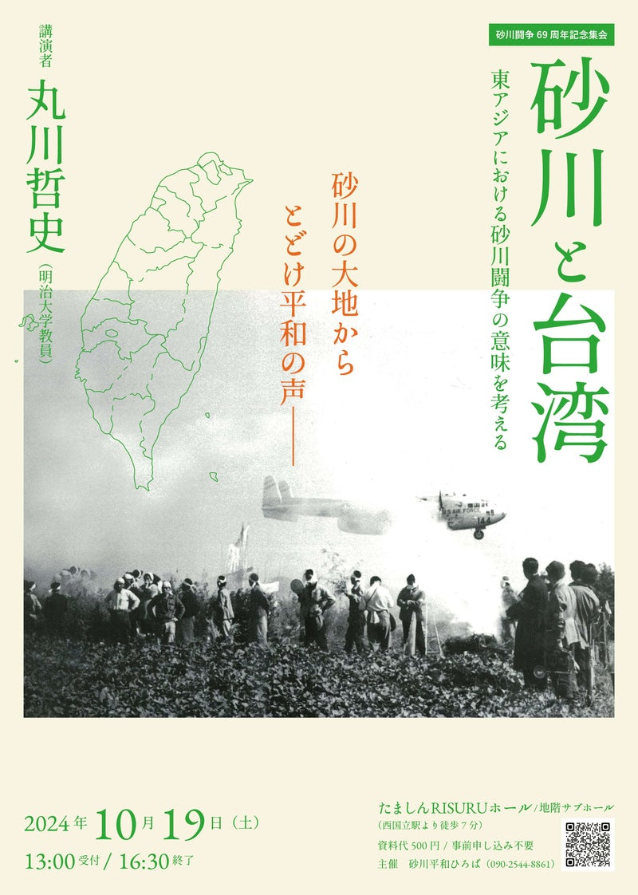</a>

 

2025年

<a href="../../images/2022/ameblo-12737973292/11.jpg">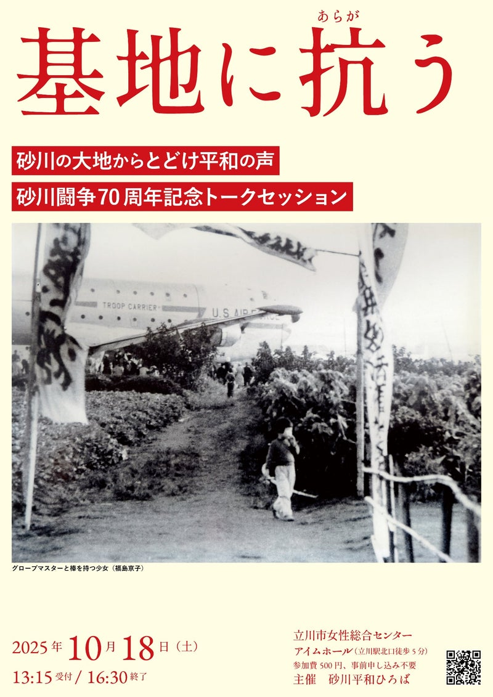</a>

 

〈完〉

2025年12月

