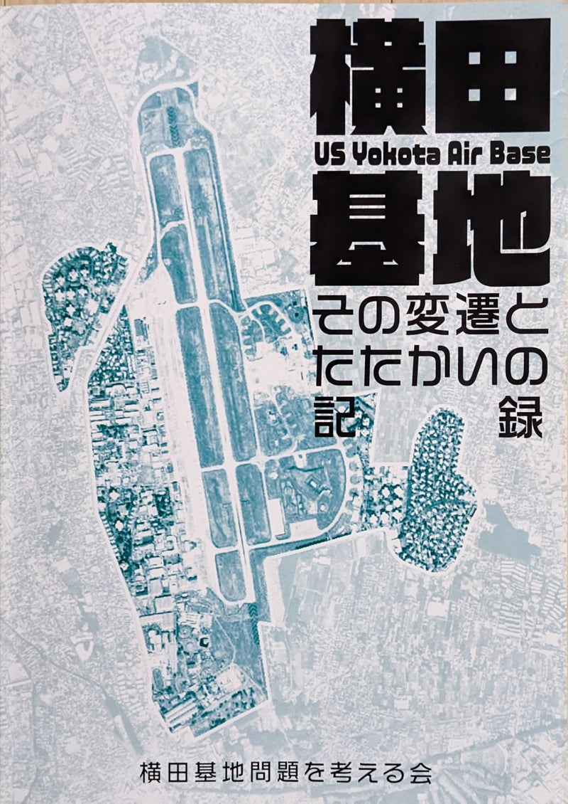
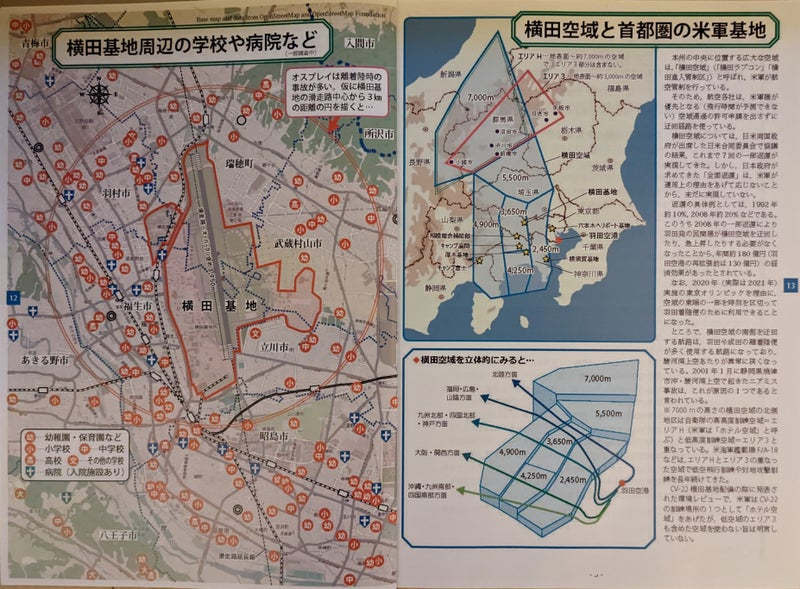
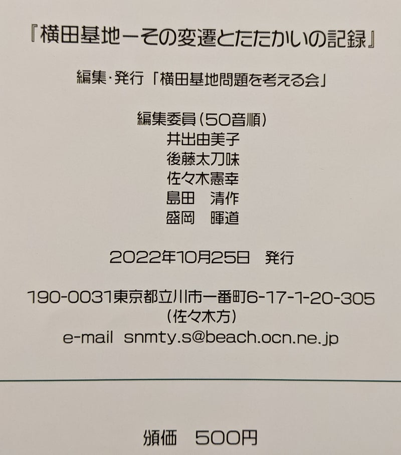

Original source / 原文の出典: https://ameblo.jp/2021fukuoka-ameba/entry-12775319604.html

既報のとおり、2022年11月7日に、V-22オスプレイが2023年1月以降、自衛隊木更津駐屯地から立川飛行場へ飛来する予定である、との計画が知らされてから、砂川平和ひろばでは福島代表を中心に、情報収集と対策についての話し合いを行っています。

まずは地元立川の他団体や市民とも協力して、反対の声を上げていきます。

<a href="../articles/ameblo-12773469394.html">オスプレイが来る！　防衛当局と地元自治体による受入れ体制作り | 砂川平和ひろば Sunagawa Heiwa Hiroba (ameblo.jp)</a>

 

おりしも先月（2022年10月）、「横田基地問題を考える会」が作成した冊子『横田基地　その変遷とたたかいの記録』が発行されました。

 

「砂川事件」をめぐる裁判闘争を最後まで闘い抜いた弁護士の一人、新井章弁護士が、インタビューの最後で複雑な思いを吐露していたように、砂川闘争の「勝利」は、横田や沖縄の基地問題とあわせて考え続けなければならない課題を残しました。

<a href="../articles/ameblo-12745889284.html">新井章弁護士　インタビュー（2020年10月） | 砂川平和ひろば Sunagawa Heiwa Hiroba (ameblo.jp)</a>

 

米軍横田基地では、1974年に第５空軍司令部、在日米軍関東司令部が移駐して、爆音に悩まされた地元住民が「第一次横田基地騒音訴訟」を起こしました。以来、「静かな夜をかえせ」という声をひとつに、広い住民の参加を求めて運動が続けられ、実際には、騒音だけにとどまらず、様々な基地公害問題にとりくんできました。

しかし、首都東京の空を制する横田基地は、米軍の再編に応じてむしろ増強を続け、結果的に「米軍再編」計画には明記されていなかったオスプレイの配備を伴いました。

 

2012年、2013年と沖縄の普天間基地にMV-22オスプレイが持ち込まれ、2013年、2014年にCV-22の日本への配備問題が浮上すると、横田基地への配備の危険性を重視した市民たちが、講演会や市民交流集会を企画しました。

その実行委員の小柴康男さんは、米軍の資料や軍事関係のシンクタンクの論文を読み込んで、渾身のブックレットを作成しました。

 

近刊の『横田基地　その変遷とたたかいの記録』は、そのような長年の活動と情報収集の成果を、フルカラーの地図や写真とともにまとめたもので、ヴィジュアル的にもインパクトあるパワフルな冊子です。

その４ページに、オスプレイは離着陸時の事故が多いことから横田基地の滑走路を中心に半径３kmの円を描いた地図が掲載されています。その円内と周辺には、多数の学校や病院が存在していることが一目瞭然です。

 

　　　　　　　

 

もちろん立川市も円内に入っています。

自衛隊立川駐屯地の飛行場にもオスプレイが飛来し、訓練がくり返されれば、危険は一層高まります。いずれにせよ、横田や立川に限定される問題ではありません。

 

オスプレイの事故は、試作段階から多発していたようで、配備後の事故としては、2016年12月13日の沖縄県名護市近海の浅瀬に墜落した事故が知られています。海外では、訓練中に砂漠や森林地帯に墜落した事故が目立ちます。人家を避けて使用されていたものと思われます。

日本の首都圏の住宅地への飛来や訓練計画など、いかに危険極まりないものか。

横田の人々が訴え続けてきた声を、無駄にはできません。

市民が正しい情報を得てリスクを判断するより先に、立川市など駐屯地周辺の８市が、議会にはかることもなく、受け入れを前提とした要請を行っていることなど、黙認するわけにはいきません。

市長たちの結束に後れを取った市民側も、なんとか自治体の境界や党派の枠を超えて、声を広げる必要があります。

 

「横田基地問題を考える会」編集・発行の『横田基地　その変遷とたたかいの記録』は、「横田基地の概要」「たたかいの記録」「年表」などから成る全56頁。頒価500円で入手可能です。

e-mail:

snmty.s@beach.ocn.ne.jp

 

 

 
　

 

