Original source / 原文の出典: https://ameblo.jp/2021fukuoka-ameba/entry-12787210957.html

 

<a href="../../images/2023/ameblo-12787210957/01.jpg">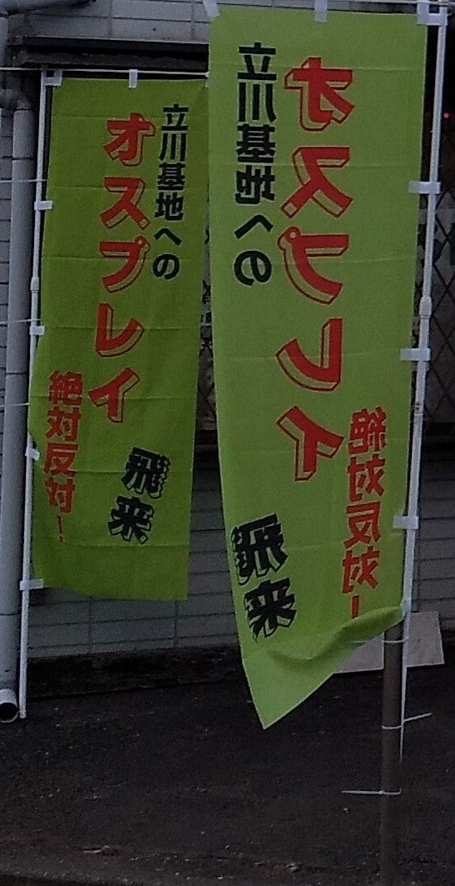</a> 前日（2023年1月31日）の砂川平和ひろば

 

<a href="../../images/2023/ameblo-12787210957/02.jpg">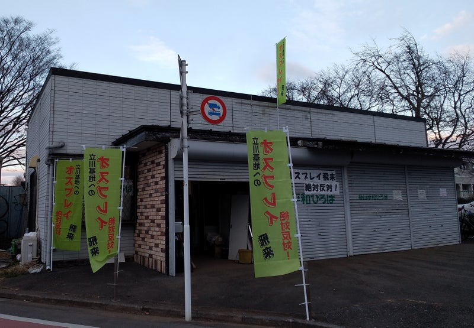</a>

 

<a href="../../images/2023/ameblo-12787210957/03.jpg">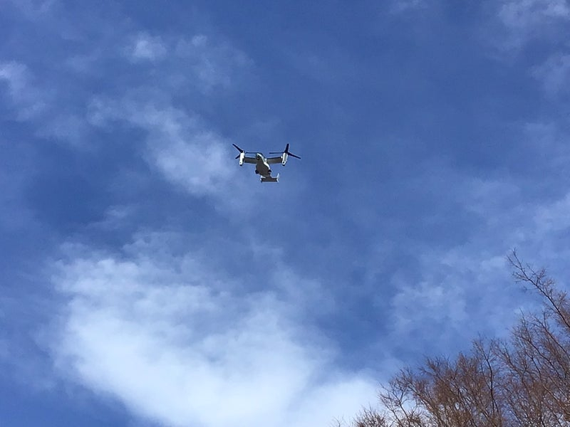</a>

2023年2月1日　11時前　

砂川平和ひろばの北方からオスプレイ飛来し自衛隊駐屯地へと向かう。

 

<a href="../../images/2023/ameblo-12787210957/04.jpg">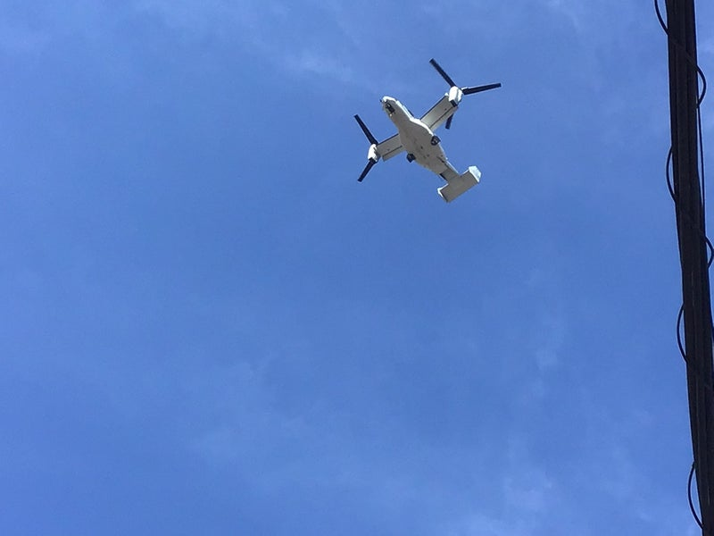</a>

 

<a href="../../images/2023/ameblo-12787210957/05.jpg">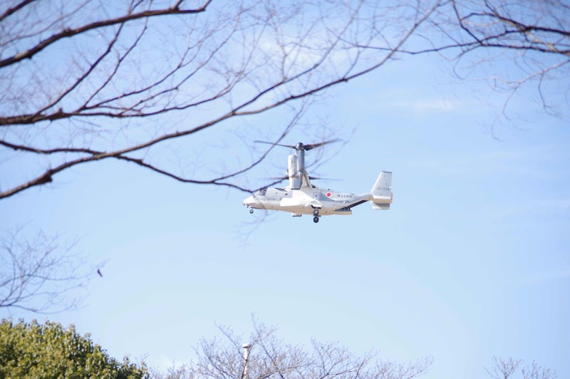</a>

飛行場に着陸。合計２回の離着陸「飛行訓練」が目撃された。

 

<a href="../../images/2023/ameblo-12787210957/06.jpg">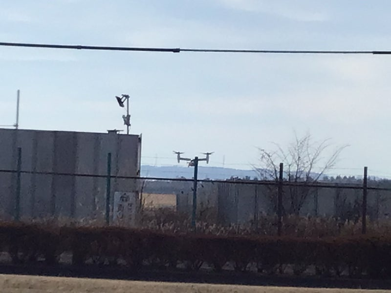</a>

 

<a href="../../images/2023/ameblo-12787210957/07.jpg">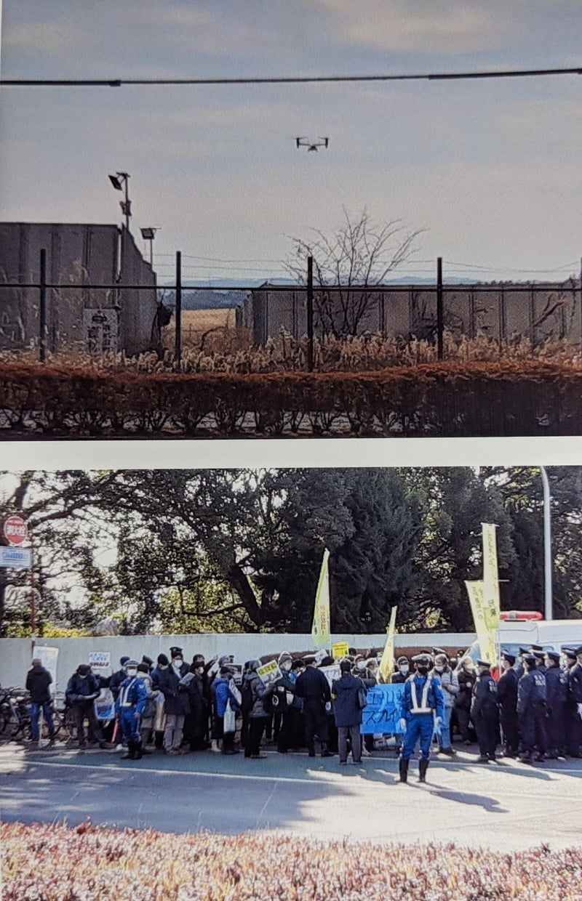</a>

 

<a href="../../images/2023/ameblo-12787210957/08.jpg">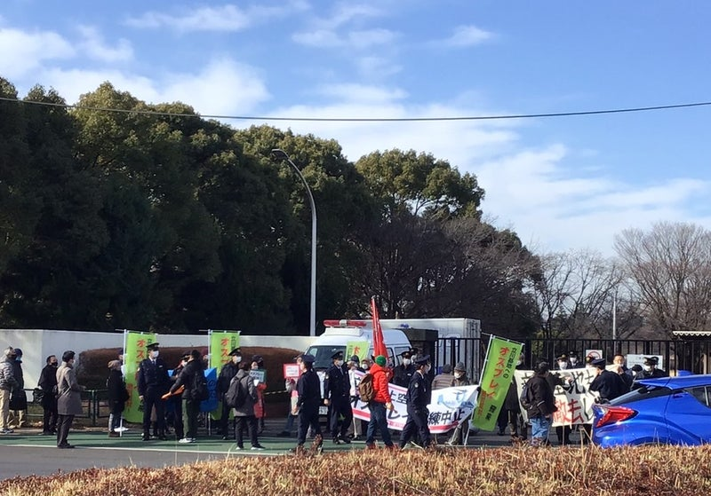</a>　<a href="../../images/2023/ameblo-12787210957/09.jpg">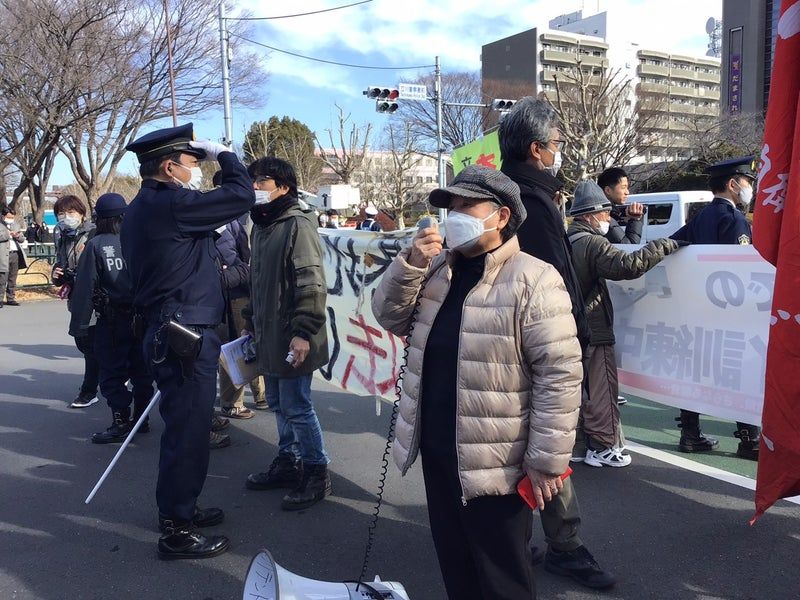</a><a href="../../images/2023/ameblo-12787210957/10.jpg">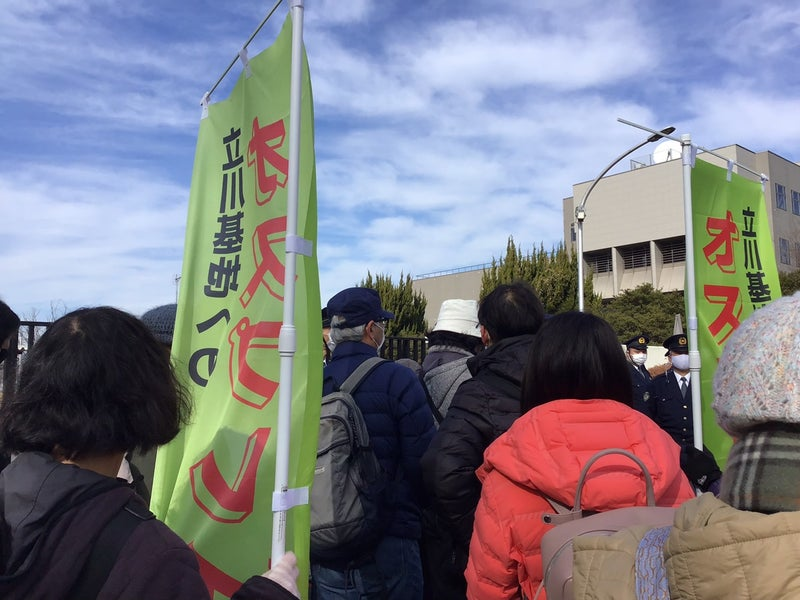</a><a href="../../images/2023/ameblo-12787210957/11.jpg">　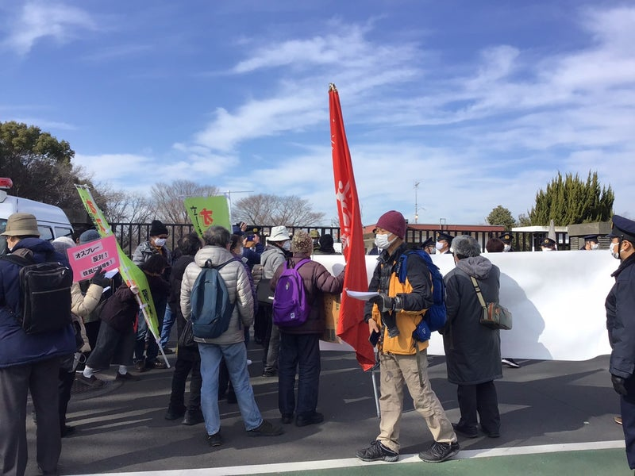</a>

抗議行動は午前と午後にわたって行われた。

<a href="../../images/2023/ameblo-12787210957/12.jpg">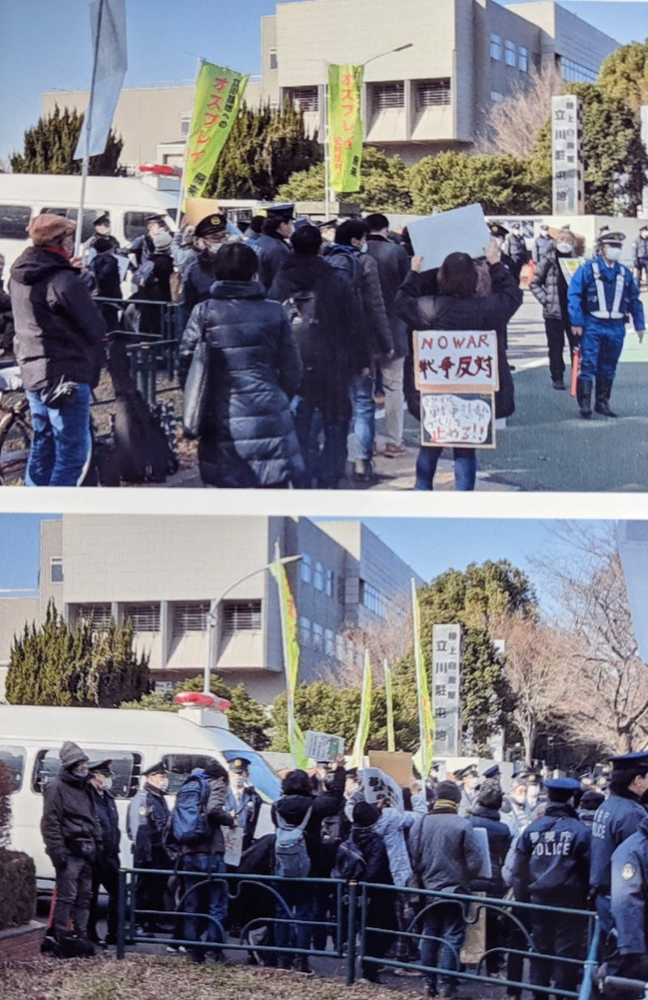</a>

 

<a href="../../images/2023/ameblo-12787210957/13.jpg">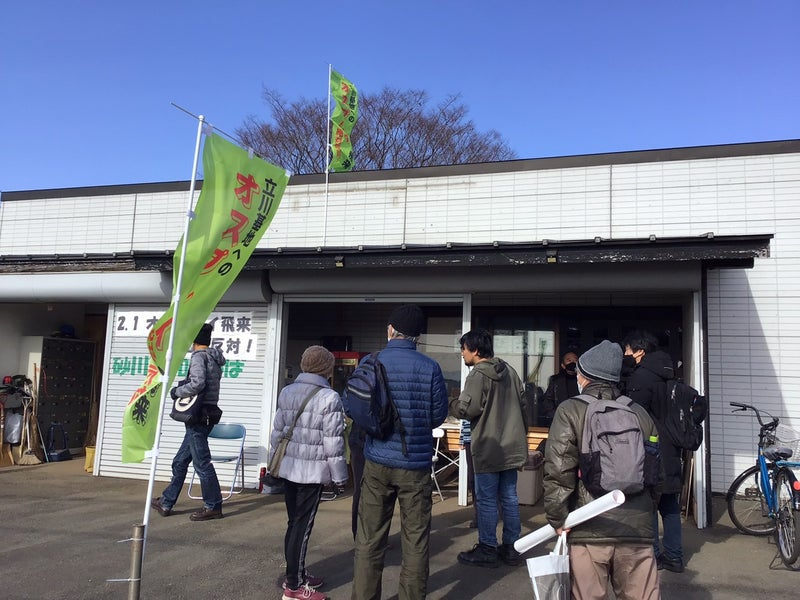</a>

 

<a href="../../images/2023/ameblo-12787210957/14.jpg">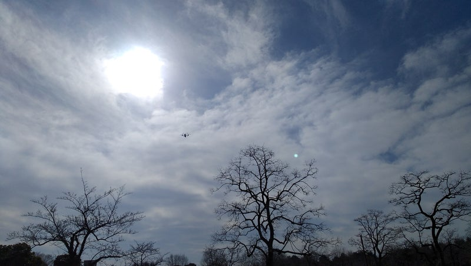</a>

去って行くオスプレイ。

 

オスプレイの飛来は、以下のツィッターでリアルタイムにレポートされました。

<a href="https://twitter.com/YumikoInahashi">いなはしゆみ子 立憲民主党 立川市議会議員（@YumikoInahashi）さん / Twitter</a>

 

