Original source / 原文の出典: https://ameblo.jp/2021fukuoka-ameba/entry-12829791573.html

今日 2023年11月23日 午後２時から、沖縄と同時開催「沖縄も日本も戦場にさせるな！」集会が、国会正門前で行われました。

<a href="../articles/ameblo-12827034744.html">リンク集 2023年11月（反基地・平和 メイン･イベント） | 砂川平和ひろば Sunagawa Heiwa Hiroba (ameblo.jp)</a>

 

<a href="../../images/2023/ameblo-12829791573/01.jpg">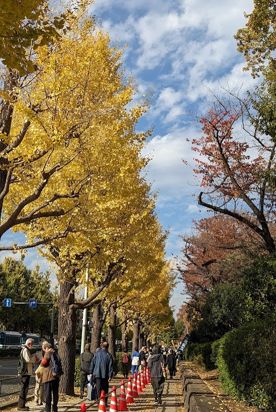</a>

 

<a href="../../images/2023/ameblo-12829791573/02.jpg">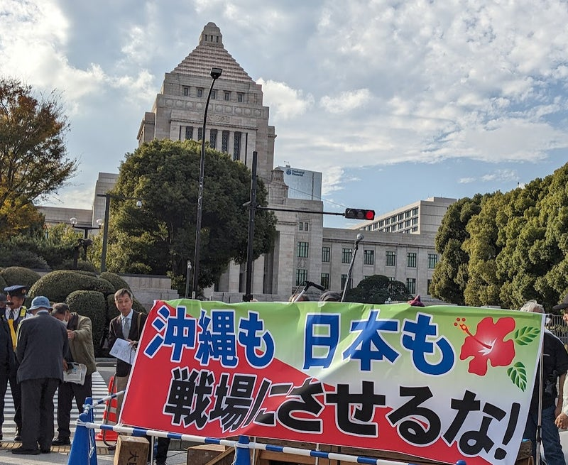</a>

 

 

<a href="../../images/2023/ameblo-12829791573/04.jpg">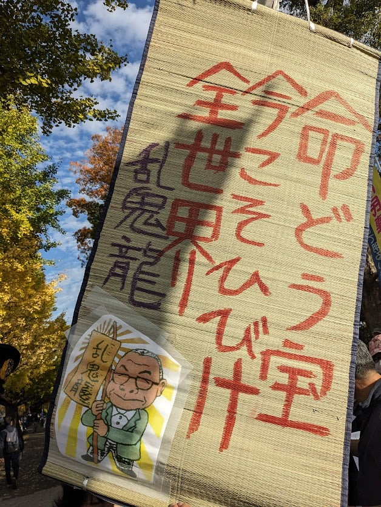</a>

 

<a href="../../images/2023/ameblo-12829791573/05.jpg">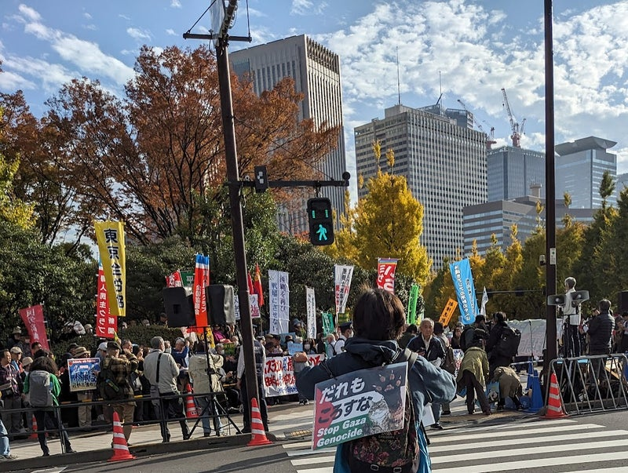</a>

 

 

<a href="../../images/2023/ameblo-12829791573/07.jpg">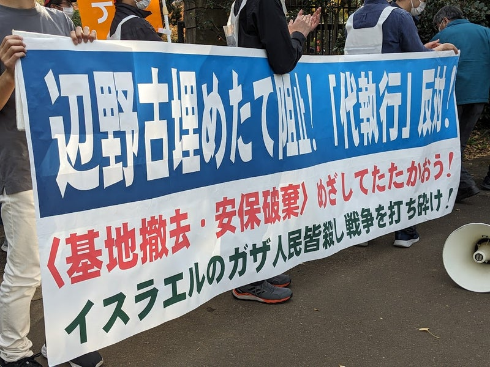</a>

 

 

<a href="../../images/2023/ameblo-12829791573/09.jpg">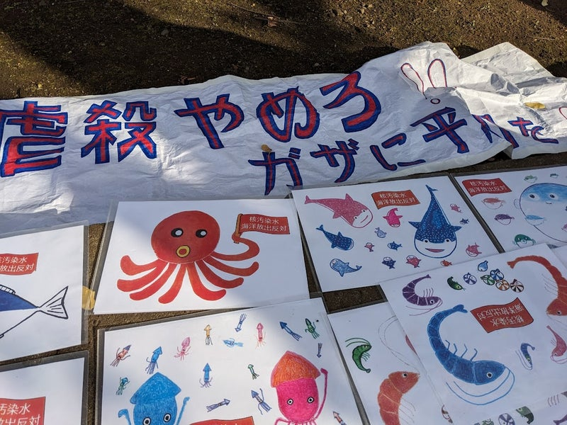</a>

 

<a href="../../images/2023/ameblo-12829791573/10.jpg">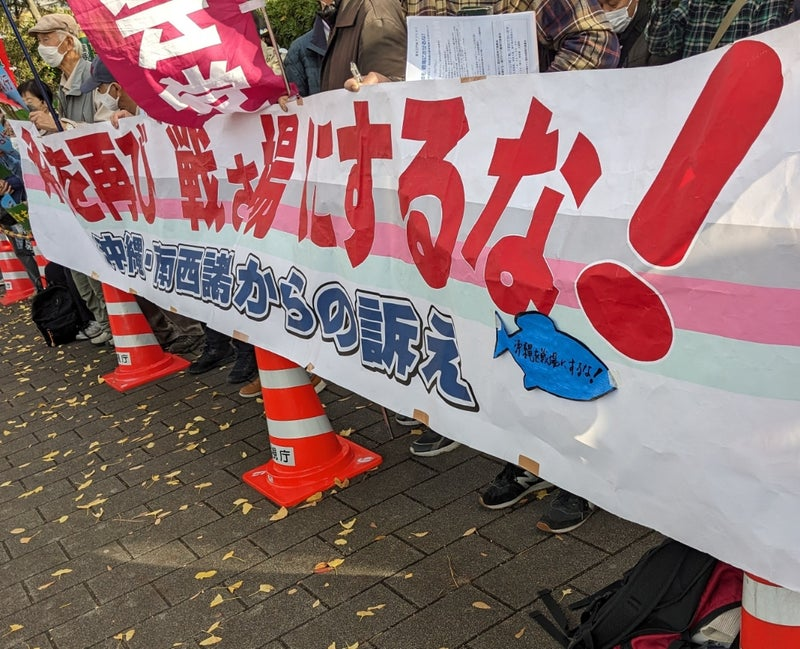</a>

 

 

<a href="../../images/2023/ameblo-12829791573/12.jpg">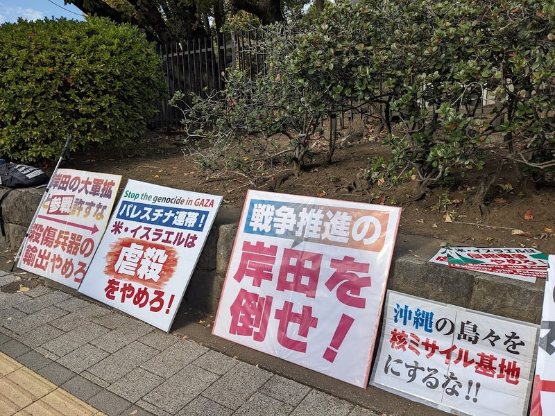</a>

 

<a href="../../images/2023/ameblo-12829791573/13.jpg">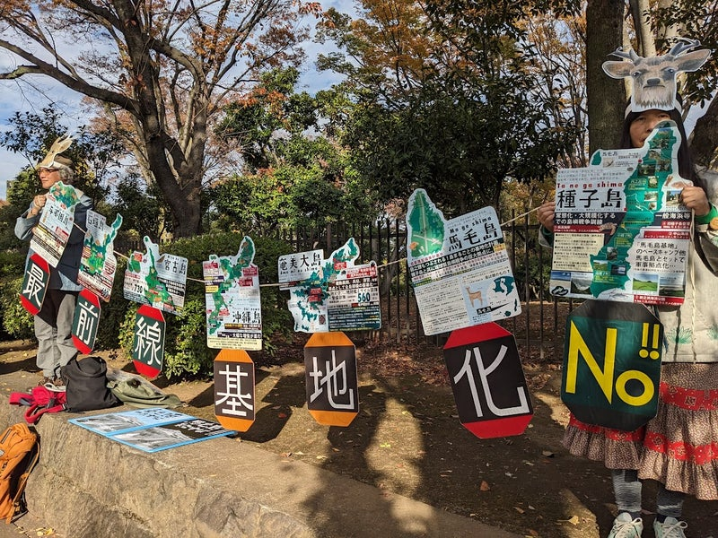</a>

 

<a href="../../images/2023/ameblo-12829791573/14.jpg">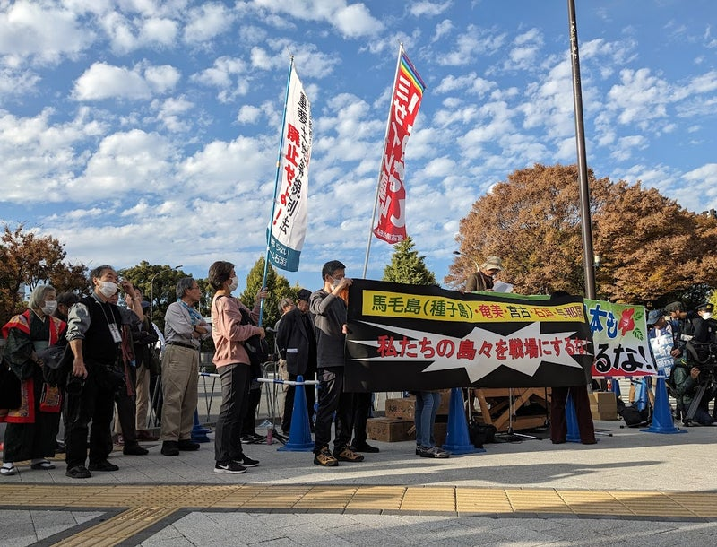</a>

 

<a href="../../images/2023/ameblo-12829791573/15.jpg">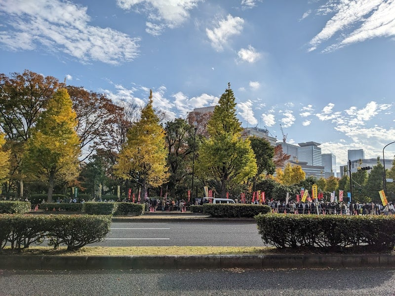</a>

 

この集会は、「やめよう！辺野古埋め立て」国会包囲実行委員会の主催により、85にのぼる団体の協賛を得て開催されました。

特に「辺野古埋め立て」代執行や南西諸島の軍事要塞化が強行されつつあり、ガザへの空爆のニュース映像の記憶も生々しいなかでのことで、国会正門前は、なんとしても戦争へと向かう道筋を阻止したいという切実さにあふれていました。

 

特に 与那国島 、 宮古島 、 奄美大島 、 石垣島 、種子島など南西諸島各地からの報告は生々しいものでした。安保三文書が閣議決定されて以来、日米共同訓練や民間空港の軍事利用など、明らかに憲法違反である「戦争のための軍隊」の既成事実化が進んでいるのでした。

自衛隊員からの血液採取によって血液製剤が作られ戦地で米軍と共用される計画や、遺体の収容訓練などに至るまで、着々と戦争準備がなされているらしいにもかかわらず、有事の際の島民避難や保護（シェルター）などの対策は、全くリアリティに乏しいことも明らかでした。

むしろ島を出ることを勧める地元首長もいるとのことで、島民の歴史も暮らしも未来をも奪う事態になっているのです。それほどの「有事」があるのか、その根拠も多様な選択肢も十分議論されないまま、私たちの知らない膨大な金と人が使われ続けています。

緊迫感の伝わる訴えは、国会前庭の木々の間にも響き渡り、聞く者の胸に届き、遠い島々の他人事ではすまされない身近な問題を再認識させられました。

 

<a href="../../images/2023/ameblo-12829791573/16.jpg">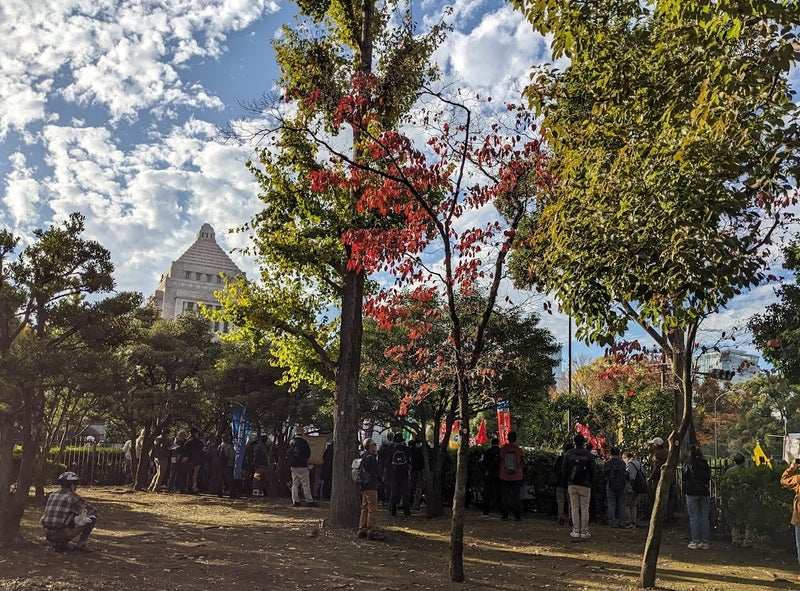</a>

 

