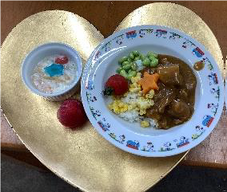
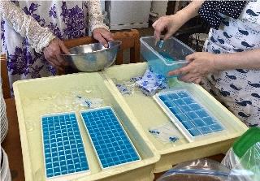
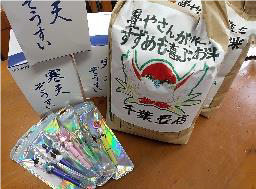
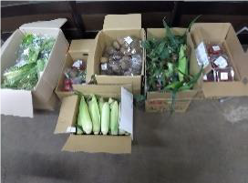
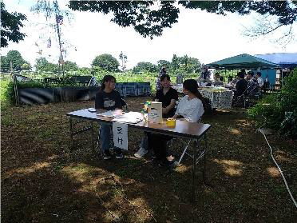
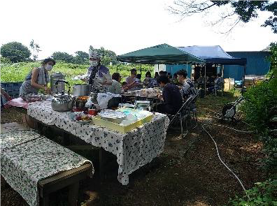
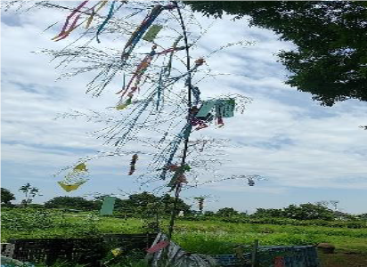

Original source / 原文の出典: https://ameblo.jp/2021fukuoka-ameba/entry-12861599830.html

今月（2024年7月）の　ひろば食堂ふらっと は　7月7日（日）に開催されました。 子ども13人 大人7人が参加し、大学生7人を含めてボランティア さん19人も集まりました。 この日にちなんで、メニューは七夕カレー＆七夕ゼリー。

 

 

 

 お米や ゼリー、ジャガイモ・玉葱・枝豆・トウモロコシなどが、市民の方々とわくわく広場さんから提供されました。

 

 

 

食事は、日差しを避けて木陰で。

 

 

 

パントリーには、 10世帯40人の方々が来場。フードバンクたま・市民・社協さんから提供されたお米や、ららぽーとわくわく広場提供の野菜、社協提供のお水・ドレッシング・お菓子等が手渡されました。 食後のふらっと教室では七夕飾りをつくりました。

 

 

まだまだ暑さは続きます💦

 

🎐暑中お見舞い申し上げます🎐

