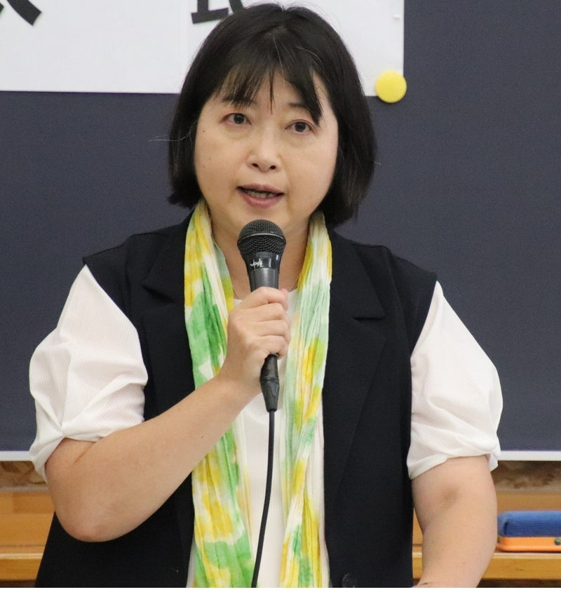
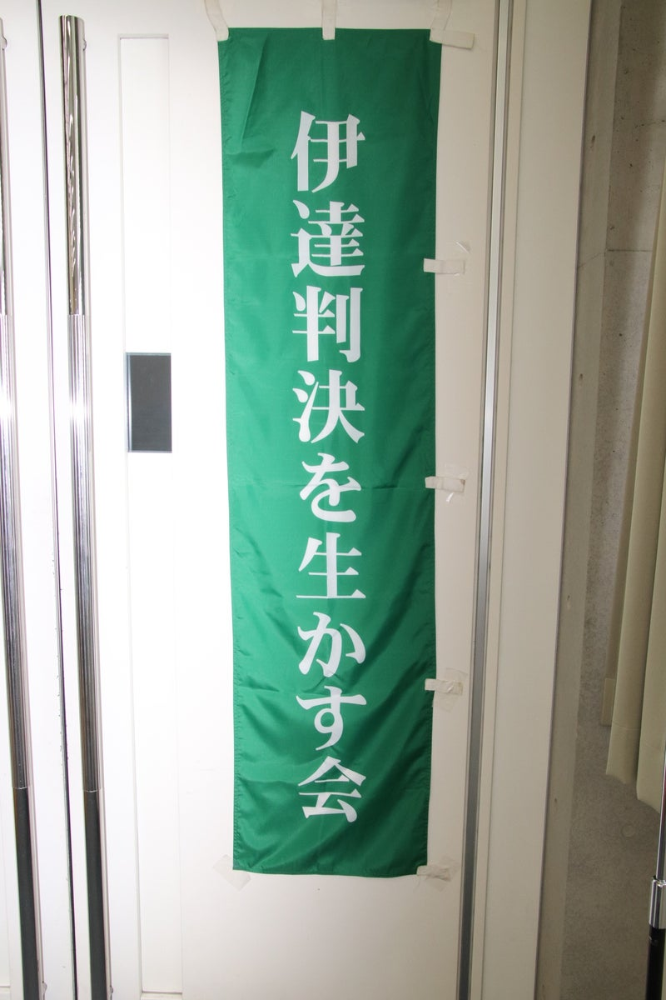
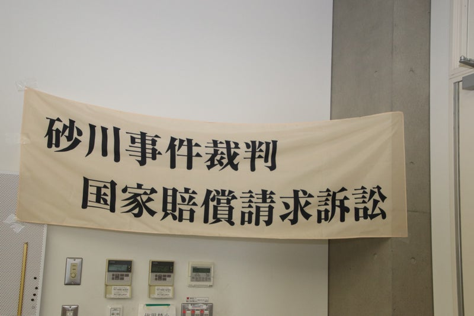

Original source / 原文の出典: https://ameblo.jp/2021fukuoka-ameba/entry-12863826928.html

「伊達判決を生かす会」の2024年7.13記念集会レポート(1)に続き

<a href="../articles/ameblo-12863375762.html">「伊達判決」65周年「伊達判決を生かす会」結成15周年　7.13記念集会レポート(1) | 砂川平和ひろば Sunagawa Heiwa Hiroba (ameblo.jp)</a>

 

今回は、同会事務局長である西尾綾子さんによる活動報告を紹介します。

「伊達判決を生かす会」の了解を得て作成した発言採録に基づいて、本ブログ用にまとめたものです。

 

<h3 class="ameba_heading06" data-entrydesign-alignment="left" data-entrydesign-count-input="part" data-entrydesign-part="ameba_heading06" data-entrydesign-tag="h3" data-entrydesign-type="heading" data-entrydesign-ver="1.54.1" style="display:flex;flex-direction:column-reverse;margin:8px 0;color:#333;font-weight:bold">
  事務局報告　　西尾 綾子
</h3>

●結成から15年、140回におよぶ定例会議開催

2009年に結成されてから今年で15年目。この間、多くの皆さまに支えられたから運営を続けてくることができた。再審請求、そして現在も続いている国家賠償請求訴訟と、提起してきた。この15年間、コロナ禍で出来ないときもあったが、千代田区の自治労会館を借りてほぼ毎月、定例会議を行ってきた。定例会は、先月6月29日（土曜日）で140回目を迎えた。会議参加者は大体10名から20名ほどで、裁判について弁護士の先生からお話をうかがったり、意見交換をしたり、今日のような記念集会の企画を練ったりしている。

 定例会議に参加するメンバーは60代、70代、80代が中心。時には3時間くらい議論することもあり、ニュースレターの発送作業も入ったりすると、終わりは夜の7時になることもある。コロナ禍前は定例会の後に毎回、居酒屋で懇親会を開いて盛り上がった。皆さんタフで疲れ知らず、さすがは砂川闘争経験者、とビックリしていたが、元気だった方々も一人また一人と旅立っていかれた。  ●ニュースレター発行と記念集会の企画・開催 伊達判決を生かす会では、不定期ながらニュースレターを発行してきた。2019年に国賠訴訟を提起してからは、「砂川事件国家賠償請求訴訟ニュース」という名称で、法廷が開かれる度に、その報告という形で発行を続けてきた。今年2月17日に発行したニュースで第15号を迎えた。これは全国約700名以上の支援者や関係者の方々に郵送している。

 記念集会も毎年開催してきた。伊達判決が出た3月30日、もしくは基地に立ち入った7月8日に近い日程、ということで毎年3月から7月の間に開催し、多くの皆さまにご参加いただいている。講師の方々は直近では、孫崎享さん、吉田敏浩さん、水島朝穂さん、白井聡さん、山内敏弘さんをお招きしている。  ●この15年間の変化と現状への危機感 伊達判決を生かす会結成から15年、安倍政権の集団的自衛権行使容認から10年、この間、安倍政権・菅政権は戦争のできる国づくりを進めてきた。そして今、岸田政権は戦争のできる国ではなく、戦争をするための国へとステージを変えた。大軍拡、経済安保、地方自治法改悪、マイナンバーなど、私たちの身の回りのありとあらゆることが、実は戦争準備のものであると、もう日本は新しい戦前どころではなく、戦争は「廊下の奥に立っていた」とそういう危機的状況にあるということを感じている。

 まだ多くの国民が気づいていない。そういった状況において集団的自衛権行使容認の口実とされ、捻じ曲げた解釈で利用された砂川事件最高裁判決――この最高裁判決がデタラメな、司法の独立を揺るがすインチキな裁判によるものであるということを、私たちはしっかりと世に問うていく、そして訴えていく。戦争は絶対にやってはいけない、平和を守らなければならないということを一緒に訴えていく。そのためにも伊達判決を生かす会は、まだまだやらなければならないことが沢山ある。

 土屋共同代表は、この夏で90歳になる。あと最低10年は続けることができるので、皆さま今後もこの会を支えて下さるようお願いします。

 

　　　　

 

撮影はいずれも川島進さん。

川島さんのFBから使わせていただきました。

 

