Original source / 原文の出典: https://ameblo.jp/2021fukuoka-ameba/entry-12904053944.html

あっという間に春から初夏へ

 

<a href="../../images/2025/ameblo-12904053944/01.jpg">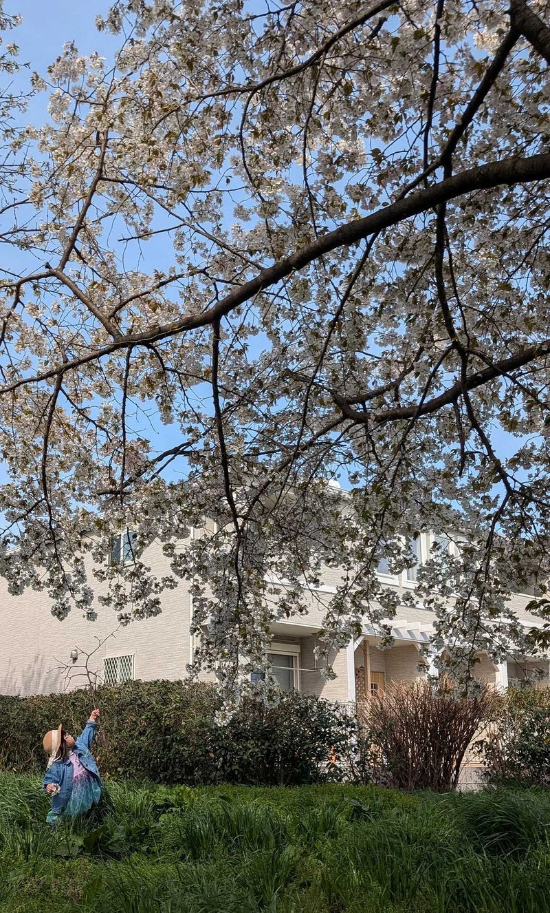</a>　　　<a href="../../images/2025/ameblo-12904053944/02.jpg">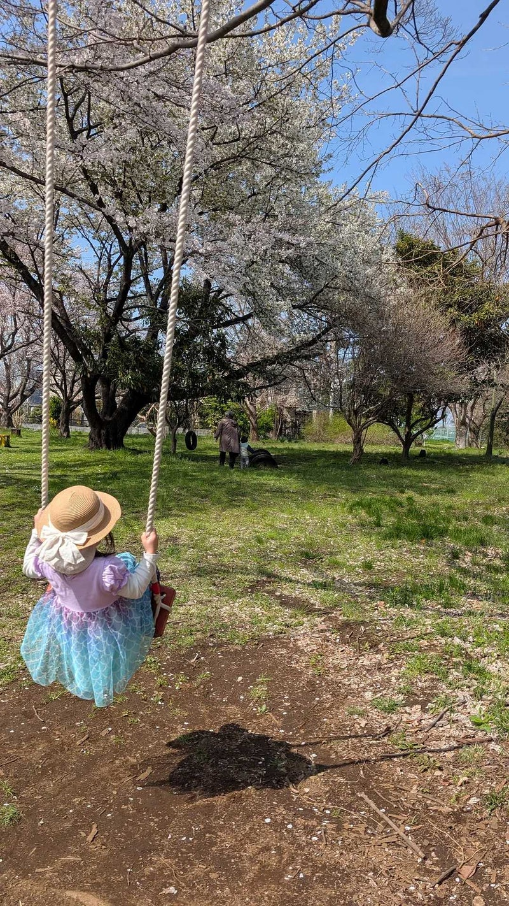</a>

　　

 

砂川の季節の移り変わりを、2025年３月～５月に開催された子ども食堂とパントリー、そしてふらっと教室の写真でふりかえります。

 

<mark style="background-color:#0080ba;color:inherit;">2025年３月２日（日）</mark>

 

<mark style="background-color:#00afff;color:inherit;"><a href="../../images/2025/ameblo-12904053944/03.jpg">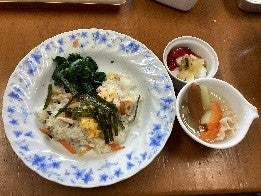</a></mark>

 

<a href="../../images/2025/ameblo-12904053944/04.jpg">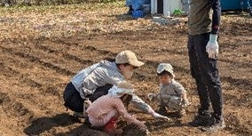</a>　　<a href="../../images/2025/ameblo-12904053944/05.jpg">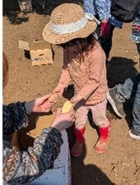</a>

 

<mark style="background-color:#00afff;color:inherit;"><a href="../../images/2025/ameblo-12904053944/06.jpg">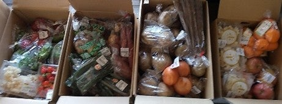</a></mark>

 

<a href="../../images/2025/ameblo-12904053944/07.jpg">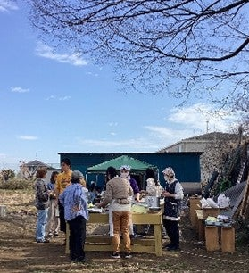</a>

 

<mark style="background-color:#00afff;color:inherit;">2025年４月６日（日）</mark>

 

<a href="../../images/2025/ameblo-12904053944/08.jpg">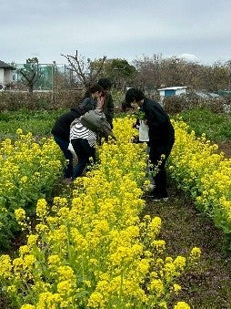</a>

 

<a href="../../images/2025/ameblo-12904053944/09.jpg">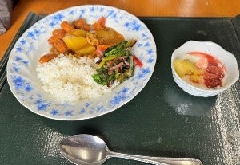</a>

 

<a href="../../images/2025/ameblo-12904053944/10.jpg">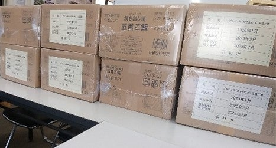</a>

 

<a href="../../images/2025/ameblo-12904053944/11.png">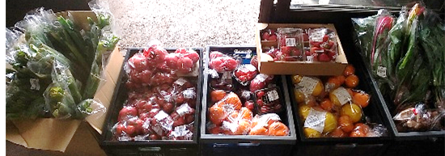</a>

 

<a href="../../images/2025/ameblo-12904053944/12.png">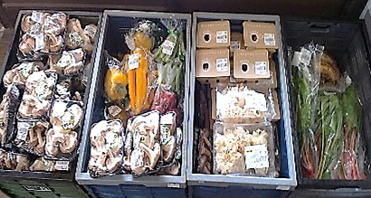</a>

 

<mark style="background-color:#00afff;color:inherit;">2025年５月４日（日）</mark>

 

<mark style="background-color:#00afff;color:inherit;"><a href="../../images/2025/ameblo-12904053944/13.png">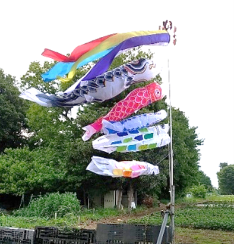</a></mark>

 

<a href="../../images/2025/ameblo-12904053944/14.jpg">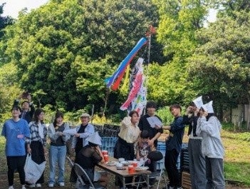</a>

 

<a href="../../images/2025/ameblo-12904053944/15.jpg">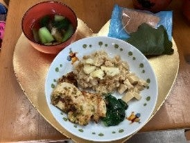</a>

 

<a href="../../images/2025/ameblo-12904053944/16.jpg">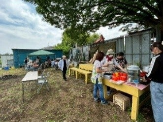</a>

 

<a href="../../images/2025/ameblo-12904053944/17.jpg">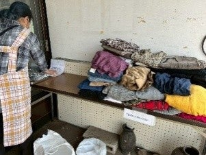</a>

食材だけでなく、衣料品の提供も受けて皆さんにご利用いただくことができました。

 

これからも、砂川平和ひろばの子ども食堂とふらっと教室は、毎月第一日曜日に開催します。

 

電話：042-536-3167

 

<a href="https://hirobasyokudoufura.wixsite.com/website/about-3">ひろば食堂ふらっと・ふらっと教室 | ひろば食堂ふらっと（子ども食堂）</a>

 

<a href="https://hirobasyokudoufura.wixsite.com/website/%E3%81%94%E5%AF%84%E4%BB%98">ご寄付 | ひろば食堂ふらっと（子ども食堂）</a>

 

<a href="https://hirobasyokudoufura.wixsite.com/website/contact-3">ボランティア募集 | ひろば食堂ふらっと（子ども食堂）</a>

 

