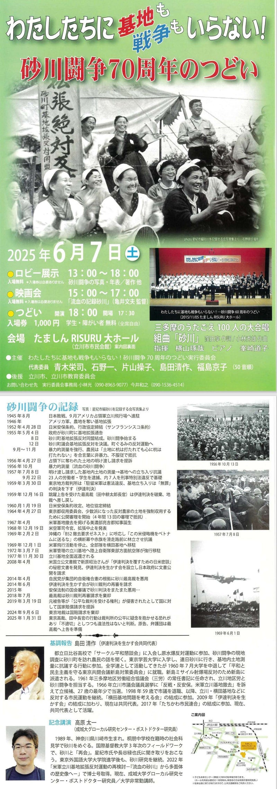

Original source / 原文の出典: https://ameblo.jp/2021fukuoka-ameba/entry-12907468172.html

今年2025年は、敗戦から80周年であり、また戦後最大規模の反基地闘争として「勝利」をおさめた「砂川闘争」開始から70周年にあたります。

地元立川市では、6月７日（土）の午後～夜、たましんＲＩＳＵＲＵ大ホール（立川市市民会館）で記念集会が開催されます。

テーマは「わたしたちに 基地も戦争もいらない！」

その企画・運営のために実行委員会が結成され、福島京子代表をはじめ砂川平和ひろばのメンバーたちも参加してきました。

また当日の基調報告は、このブログでもダスティン・ライトさんが書いた小論の和訳記事で紹介したことのある島田清作さん

<a href="../articles/ameblo-12767926016.html">ダスティン・ライトが追う 島田清作とデニス・バンクスの「砂川闘争」後 （１） | 砂川平和ひろば Sunagawa Heiwa Hiroba</a>

<a href="../articles/ameblo-12769994078.html">ダスティン・ライトが追う 島田清作とデニス・バンクスの「砂川闘争」後 （２） | 砂川平和ひろば Sunagawa Heiwa Hiroba</a>

<a href="../articles/ameblo-12770149766.html">ダスティン・ライトが追う 島田清作とデニス・バンクスの「砂川闘争」後 （３） | 砂川平和ひろば Sunagawa Heiwa Hiroba</a>

記念講演は、やはりこのブログで何度も紹介してきた高原太一さんです。

<a href="../articles/ameblo-12755173234.html">高原太一『米軍立川基地拡張反対運動の再検討』 | 砂川平和ひろば Sunagawa Heiwa Hiroba</a>

<a href="../articles/ameblo-12800793306.html">「米軍立川基地拡張反対運動の再検討」終章 | 砂川平和ひろば Sunagawa Heiwa Hiroba</a>

１３：００～１８：００の間、ロビー展示も予定されています。

１４時からは、展示の解説をかねて以下のような内容のギャラリートークが開催されます。

「砂川闘争、特に女性たちの役割」

「沖縄の戦跡と現況」

「基地拡張予定地跡地利用・砂川中央地区まちづくり構想」

